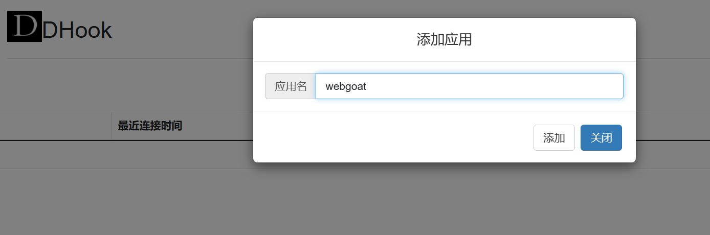
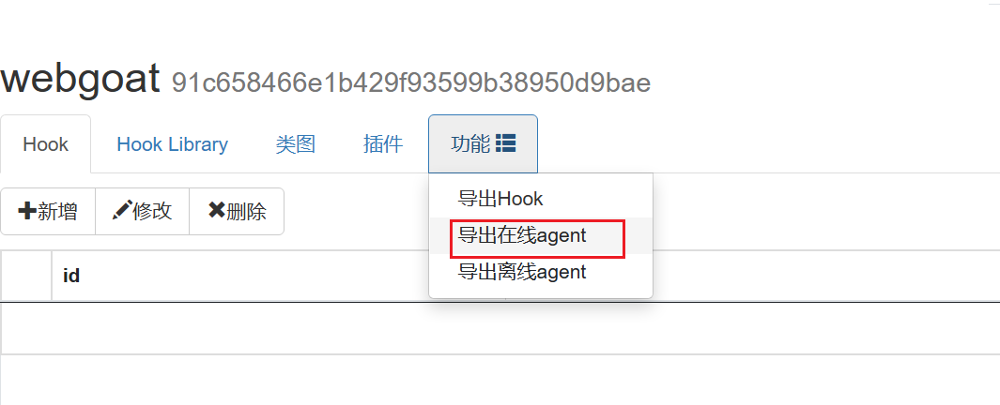
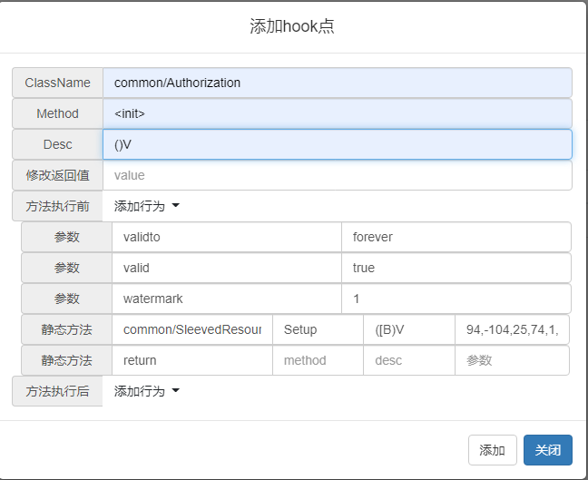

<div align="center">

# DHook 

[](https://www.oracle.com/tw/java/technologies/javase/javase8-archive-downloads.html)
[](https://www.oracle.com/tw/java/technologies/javase/javase8-archive-downloads.html)

</div>
<p align="center">
DHook是一个支持动态debug，动态修改java web应用类的参数，返回值等的web应用.
</p>

## 部署
1. `git clone https://github.com/keven1z/DHook.git` ，根目录运行`mvn clean package`或者直接下载release包
2. 本地运行
```shell
java -jar DHookServer-[release-version].jar
# http 端口:8001
# websocket 端口:7070
```

## 快速开始
### 创建应用
点击新建，创建一个应用，用于测试待hook的web应用

### 下载agent
下载agent，用于对应用进行hook


### 部署agent
在待测试应用运行时加入`-javaagent:{path}/dHook.jar`运行参数。

### 添加hook点
点击添加hook点，输入待hook的classname和method，即可进行hook

### 查看hook点信息
点击hook点详情，即可查看hook点入参，返回值以及调用栈信息。

### 案例

以破解cs4.4为例，我们已知破解cs 需要修改`common/Authorization`中的以下参数：
* validto 有效期
* valid 有效性
以及调用`common/SleevedResource.Setup`传入密钥即可。
我们在方法执行前加入对应的参数和对应破解的值，并执行`common/SleevedResource.Setup`静态方法，最后加入`return`，使`<init>`方法执行返回。
<!--静态方法中classname填写为return，默认将该方法返回，若返回不为空，则将返回值填入参数即可正常返回-->



## 文档
* [插件编写](doc/plugin.md)

## 后续计划
- [ ] 插件离线化
- [ ] 自定义配置文件
- [ ] 检测插件
- [ ] 动态辅助漏洞测试 

## 更新
### 2.5 beta1 版本 2022/12/18
* 增加心跳包断线重连
* 增加类图 类详细信息查看以及源码下载功能
* 增加hook点调用参数，调用栈等信息展示

### 2.4版本 2022/8/22
* 增加自定义ip配置功能
* 增加hook library功能
* 更新插件编写规则

### 2.3.1版本 2022/7/5
* 更新ui（凑合能看）
* 补充修改应用名和hook点信息的功能

### 2.3版本 2022/6/26
* 增加插件功能

### 2.2版本
* 增加导出仅包含hook点信息的agent

### 2.1版本
* 可以增加方法执行前后静态方法执行参数
* 增加方法执行前后，直接return

### 2.0版本
* 增加交互式的hook操作
* 增加方法执行前后的修改

### 1.1版本
* 增加通过`*`打印该类的所有方法
* 支持打印返回值
* 支持反编译代码
* 支持修改参数

### 1.0版本
* 支持hook接口，当填写的类为接口时，默认会hook所有实现的子类
* 支持更改hook类的返回类型为string，int，boolean的返回值
* 支持打印hook方法的所有参数值


